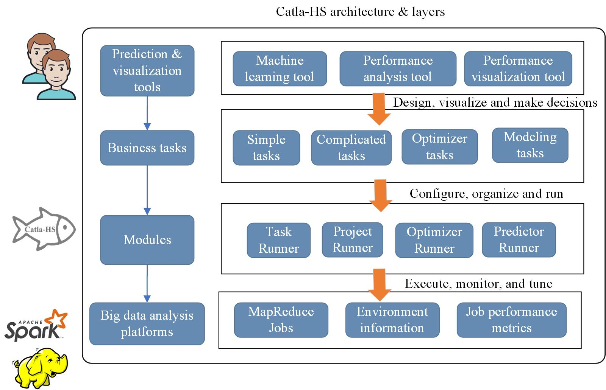
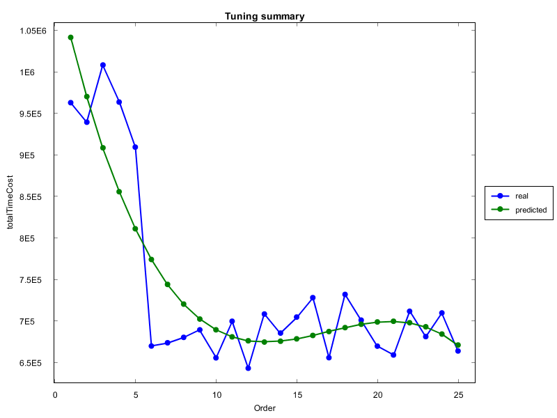

<br/>
# Catla-HS
<b>Catla for Hadoop and Spark</b> (Catla-HS) is a self-tuning system for Hadoop parameters to improve the performance of MapReduce jobs on both Hadoop and Spark clusters with plenty of advanced tools such as the  machine learning support and performance visualization tool. Catla-HS is an improved version of [Catla](https://arxiv.org/abs/1912.12456), which is our previous work that only focused on Hadoop cluster. <br> <br>This redesigned project is template-driven, making it very flexible to perform complicated job execution, monitoring and self-tuning for MapReduce performance that addressed more modern solutions like Spark. Besides, the project provides prediction and visualization tools that are easy to use for designing jobs, analyzing, visualizing and predicting the performance of MapReduce jobs. 

## Architecture
<center>

</center>

<center>Fig.1 Architecture of CatlaHS</center>

## Components
1. <b>Task Runner:</b> To submit a single MapReduce job to a Hadoop and Spark cluster and obtain its analyzing results and logs after the job is completed. 
2. <b>Project Runner:</b> To submit a group of MapReduce jobs in an organized project folder and monitor the status of its running until completion; eventually, all analyzing results and their logs that contain information of running time in all MapReduce phrases are downloaded into specified location path in its project folder. 
3. <b>Optimizer Runner:</b> To create a series of MapReduce jobs with different combinations of parameter values according to parameter configuration files and obtain the optimal parameter values with least time cost after the tuning process is finished. Two tuning processes, namely direct search and derivative-free optimization (DFO) techniques, are supported.
4. <b>Predictor Runner:</b> To provide multiple prediction models that helps fit the tuning results and predict future performance change of MapReduce jobs. [<font color='red'> New</font>](https://github.com/dhchenx/Catla-HS/blob/master/docs/catla-prediction.md)
6. <b>Performance visualization tool:</b> A tool that helps users analyze, visualize and decision making according to collected data of tuning jobs. [<font color='red'> New</font>](https://github.com/dhchenx/Catla-HS/blob/master/docs/catla-visualization.md)
7. <b>Performance analysis tool:</b> To support aggregation of MapReduce job profiles and provides a summary of time cost of each phrase in the job. [<font color='red'> New</font>](https://github.com/dhchenx/Catla-HS/blob/master/docs/catla-performance-analysis.md)
8. <b>Machine Learning mining tool:</b> To support modeling based on existing machine learning techniques using tuning data and metric data from the tuning process. [<font color='red'> New</font>](https://github.com/dhchenx/Catla-HS/blob/master/catla-hs-machine-learning/README.md)
9. <b>CatlaUI</b>: CatlaUI provides user-friendly GUI to perform important functions of Catla-HS. <a href='https://github.com/dhchenx/Catla-HS/tree/master/catla-hs-tools'>here</a>

## Flowchart of tuning
<center>

</center>

<center>Fig.2 Usag of Catla-HS that support both Hadoop and Spark</center>

 [Advanced example?](https://github.com/dhchenx/Catla-HS/blob/master/docs/catla-usage.md)

## Usage

Below lists some typical uses of Catla-HS. 

### (1) Shell

with Cata-HS.jar in Terminal

```
java -jar Catla-HS.jar -tool project -dir /your-example-folder/project_wordcount -task pipeline -download true -sequence true
```

### (2) Execute using CatlaRunner

Example 1: Submit a MapReduce job

```java
	String[] args=new String[] {
				"-tool","task",
				"-dir","\\YOUR-FOLDER\\task_wordcount"
		};
		
		CatlaRunner.main(args);
```

Example 2: Submit a composite MapReduce tasks with mutiple jobs

```java
		String[] args=new String[] {
				"-tool","project",
				"-dir","\\YOUR-FOLDER\\project_wordcount",
				"-task","pipeline",
				"-download","true",
				"-sequence","true"
		};
		
		CatlaRunner.main(args);
```

Example 3: Tuning using Exhaustive Search

```java
		String[] args = new String[] { 
					"-tool","tuning",
					"-dir", "\\YOUR-FOLDER\\tuning_similarity",
					"-clean", "true", 
					"-group", "wordcount", 
					"-upload","false", 
					"-uploadjar","true"
					
				};
			
			CatlaRunner.main(args);
```

Example 4: Tuning using BOBYQA (a method of derivative-free optimization)

```java
String[]	args = new String[] { 
					"-tool","optimizer",
					"-dir", "\\YOUR-FOLDER\\tuning_wordcount",
					"-clean", "true", 
					"-group", "wordcount", 
					"-upload","true",
					"-uploadjar","true",
					"-maxinter","1000",
					"-optimizer","BOBYQA",
					"-BOBYQA-initTRR","20",
					"-BOBYQA-stopTRR","1.0e-4"
				};
			
			CatlaRunner.main(args);
```

Advanced usage please see [here](https://github.com/dhchenx/Catla-HS/blob/master/docs/catla-usage.md)

## Analysis results using Catla-HS
### (1) Exhaustive search
<center>
<br/>
</center>
<center>Fig. 3 Three-dimensional surface plot of running time of a MapReduce job over two Hadoop configuration parameters using the exhaustive search method on Hadoop</center>
<center><br/>

<br/>
</center>
<center>Fig. 4 Two-dimensional plot of running time of a MapReduce job over one Hadoop configuration parameters using the exhaustive search method on Spark</center>

### (2) Derivative-free optimization-based search
<center>

</center>
<center>Fig. 5 Change of running time of a MapReduce job over number of iterations when tuning using a BOBYQA optimizer</center>

[Other DFO-based algorithms](https://github.com/dhchenx/Catla-HS/blob/master/docs/catla-usage.md) supported include:
1. Powell's method
2. CMA-ES
3. Simplex methods


## Fitting model:

In Catla-HS, there is an additional component called `PredictorRunner` to facilitate performance change's fitting and predition. With the use of multiple fitting analysis, we can establish the prediction model for evaluating MapReduce job performance. 

## Model support

The component currently supports:

1) linear fitting
2) multivariate linear fitting
3) logarithmic fitting
4) exponential fitting
5) polynomial fitting


An example is below:



## Credits
This project is established upon the project <a href='https://github.com/apache/hadoop'>Apache Hadoop</a>, <a href='http://commons.apache.org/proper/commons-math/'>Apache Commons Math3</a> and <a href='https://github.com/apache/mina-sshd'>Apache MINA SSHD</a> under <a href='https://www.apache.org/licenses/LICENSE-2.0'>APACHE LICENSE, VERSION 2.0</a>. 

We also used [XCharts](https://github.com/knowm/XChart) for visualizing the results. 

We currently used [Java-ML](http://java-ml.sourceforge.net/) for implementing several machine learning algorithms for Catla-HS. 

## Citation
<p>
Donghua Chen, "An Open-Source Project for MapReduce Performance Self-Tuning," arXiv:1912.12456 [cs.DC], Dec. 2019. 
</p>

OR
```
@misc{chen2019opensource,
    title={An Open-Source Project for MapReduce Performance Self-Tuning},
    author={Donghua Chen},
    year={2019},
    eprint={1912.12456},
    archivePrefix={arXiv},
    primaryClass={cs.DC}
}
```

## LICENSE
See the <a href='https://github.com/dhchenx/Catla-HS/blob/master/LICENSE'>LICENSE</a> file for license rights and limitations (GNU GPLv3).

