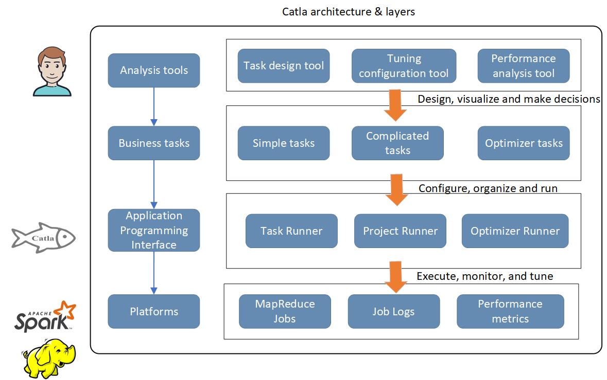
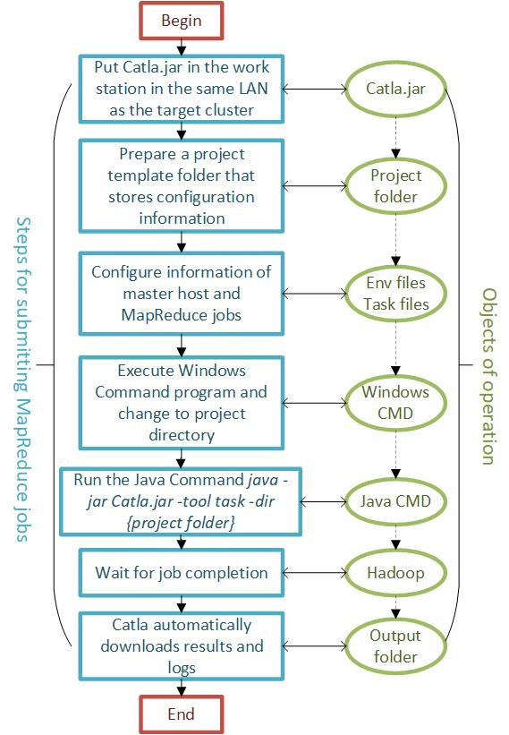
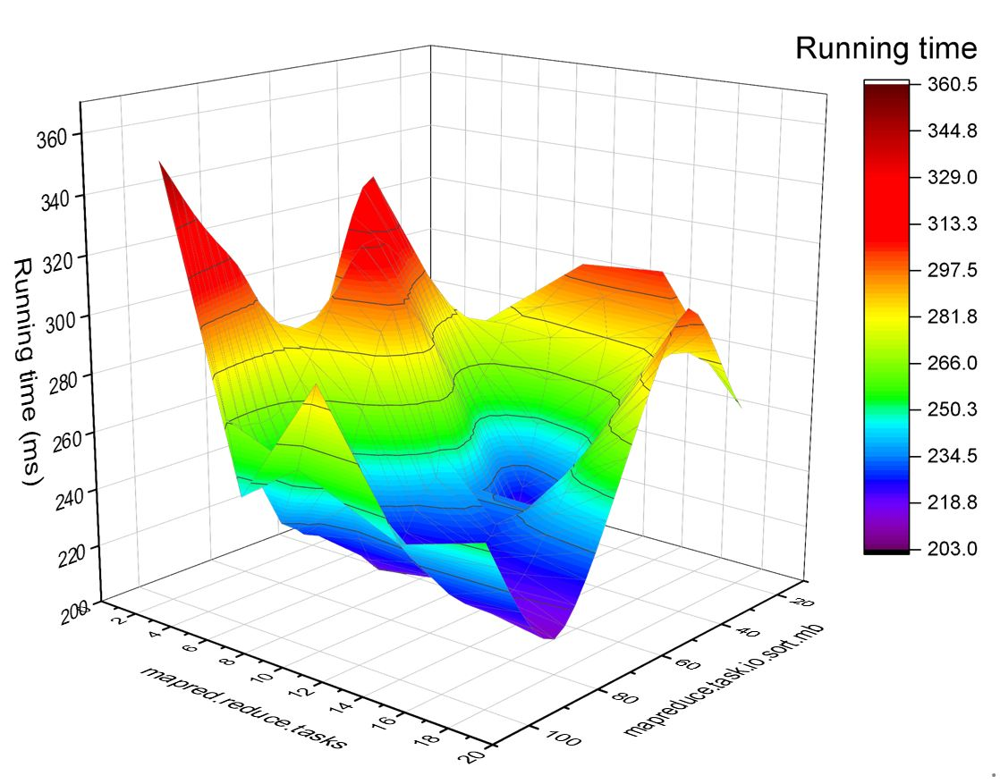
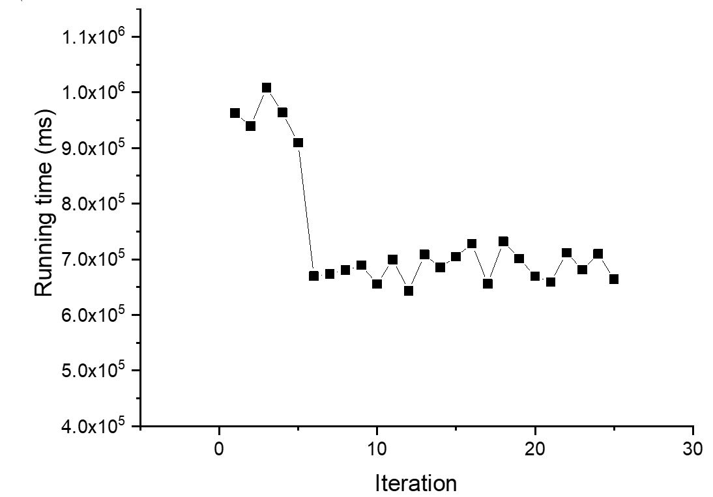
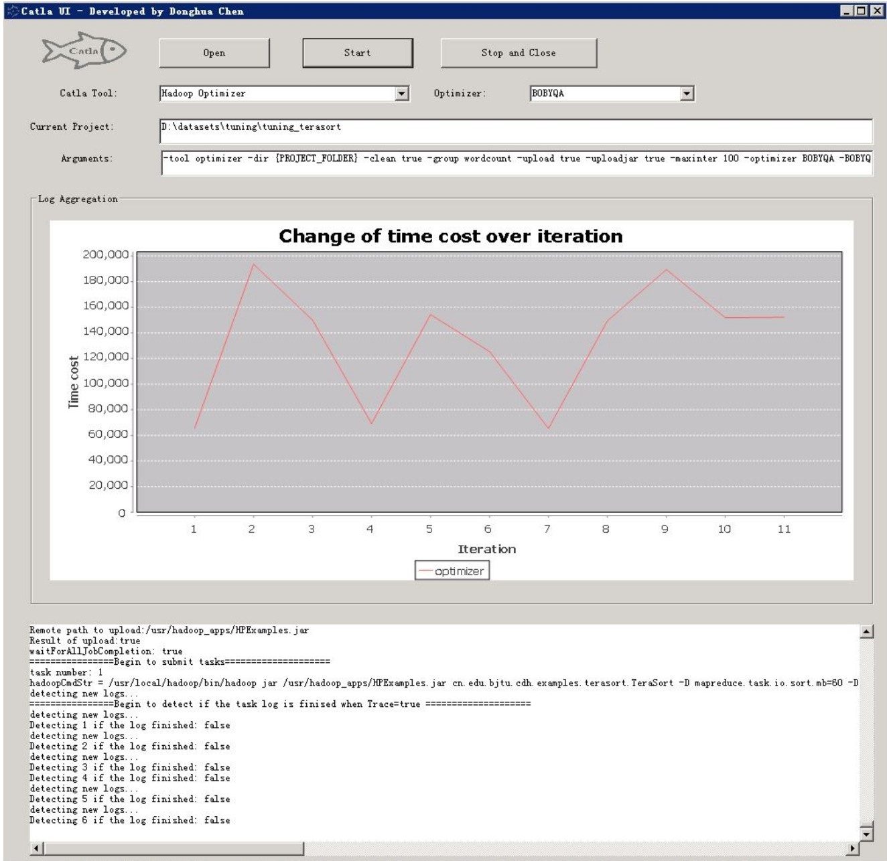

 
# Catla-HS
<b>Catla for Hadoop and Spark</b> (Catla-HS) is a self-tuning system for Hadoop parameters to improve performance of MapReduce jobs on both Hadoop and Spark clusters. Catla-HS is an improved version of [Catla](https://arxiv.org/abs/1912.12456), which is our previous work that only focused on Hadoop cluster.    This redesigned project is template-driven, making it very flexible to perform complicated job execution, monitoring and self-tuning for MapReduce performance that addressed more modern solutions like Spark. Besides, the project provides tools that are easy to use for designing jobs, analyzing and visualizing tuning results. 

## Architecture

Fig.1 Architecture of CatlaHS

## Components
1) <b>Task Runner:</b> To submit a single MapReduce job to a Hadoop and Spark cluster and obtain its analyzing results and logs after the job is completed. 
2) <b>Project Runner:</b> To submit a group of MapReduce jobs in an organized project folder and monitor the status of its running until completion; eventually, all analyzing results and their logs that contain information of running time in all MapReduce phrases are downloaded into specified location path in its project folder. 
3) <b>Optimizer Runner:</b> To create a series of MapReduce jobs with different combinations of parameter values according to parameter configuration files and obtain the optimal parameter values with least time cost after the tuning process is finished. Two tuning processes, namely direct search and derivative-free optimization (DFO) techniques, are supported.
4) <b>CatlaUI</b>: CatlaUI provides user-friendly GUI to perform important functions of CatlaJS. <a href='https://github.com/dhchenx/Catla/tree/master/catla-ui'>here</a>
5) <b>Task design tool</b>: A tool that facilitate design of tuning logic according to user needs. You don't need to configure in plain text file. 
6) <b>Tuning configuration tool</b>: A tool that faciliate settings of tuning based on expert knowledge. 
7) <b> Performance analysis tool</b>: A tool that helps users analyze, visualize and decision making according to collected data of tuning jobs. 

## Prerequisites
1) You should run Catla in a Windows/Ubuntu computer located in <b>the same network</b> as Hadoop clusters. It means Catla is able to access master host via network.
2) Standard <b>Java environment</b> on the computer should be properly installed. 
3) Hadoop must enable [Yarn Log Aggregation](https://mapr.com/docs/51/AdministratorGuide/YARNLogAggregation-Enabli_28214137-d3e129.html) by setting value of 'yarn.log-aggregation-enable' to true. 
4) Critical information of master host, like <b>username, userpassword, SSH port, etc.</b> must be known because Catla needs the information to run MapReduce jobs. 
5) You must <b>change the configuration of master host's information</b> in the env_* files in the example folder before you try to run any examples here. 
6) In your master host, please use 'sudo mkdir' command to create a new folder <b>/usr/hadoop_apps</b> in Ubuntu and change the folder's permission to every-one access. 
7) This project is built on Hadoop 2.7.2, which means it may work in all Hadoop 2.x.x versions. 

## Simple steps

Fig.1 Usag of CatlaHS

 [Advanced example?](https://github.com/dhchenx/CatlaHS/blob/master/docs/catla-usage.md)

## Anlysis using CatlaHS
### 1) Exhaustive search

 

Fig. 2 Three-dimensional surface plot of running time of a MapReduce job over two Hadoop configuration parameters using the exhaustive search method

### 2) Derivative-free optimization-based search

	

Fig. 3 Change of running time of a MapReduce job over number of iterations when tuning using a BOBYQA optimizer

### 3) CatlaUI

Fig. 4 CatlaUI: A simple desktop version of Catla to perform key functions

## Contributors
This project is established upon the project <a href='https://github.com/apache/hadoop'>Apache Hadoop</a>, <a href='http://commons.apache.org/proper/commons-math/'>Apache Commons Math3</a> and <a href='https://github.com/apache/mina-sshd'>Apache MINA SSHD</a> under <a href='https://www.apache.org/licenses/LICENSE-2.0'>APACHE LICENSE, VERSION 2.0</a>. 

## LICENSE
See the <a href='https://github.com/dhchenx/Catla/blob/master/LICENSE'>LICENSE</a> file for license rights and limitations (GNU GPLv3).

