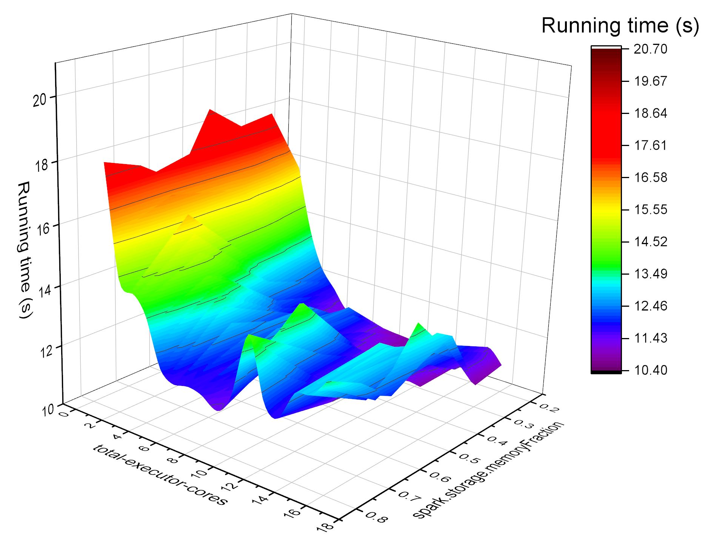

<br/>
# Catla-HS
<b>Catla for Hadoop and Spark</b> (Catla-HS) is a self-tuning system for Hadoop parameters to improve performance of MapReduce jobs on both Hadoop and Spark clusters. Catla-HS is an improved version of [Catla](https://arxiv.org/abs/1912.12456), which is our previous work that only focused on Hadoop cluster. <br> <br>This redesigned project is template-driven, making it very flexible to perform complicated job execution, monitoring and self-tuning for MapReduce performance that addressed more modern solutions like Spark. Besides, the project provides tools that are easy to use for designing jobs, analyzing and visualizing tuning results. 

## Architecture
<center>

</center>

<center>Fig.1 Architecture of CatlaHS</center>

## Components
1. <b>Task Runner:</b> To submit a single MapReduce job to a Hadoop and Spark cluster and obtain its analyzing results and logs after the job is completed. 
2. <b>Project Runner:</b> To submit a group of MapReduce jobs in an organized project folder and monitor the status of its running until completion; eventually, all analyzing results and their logs that contain information of running time in all MapReduce phrases are downloaded into specified location path in its project folder. 
3. <b>Optimizer Runner:</b> To create a series of MapReduce jobs with different combinations of parameter values according to parameter configuration files and obtain the optimal parameter values with least time cost after the tuning process is finished. Two tuning processes, namely direct search and derivative-free optimization (DFO) techniques, are supported.
4. <b>CatlaUI</b>: CatlaUI provides user-friendly GUI to perform important functions of Catla-HS. <a href='https://github.com/dhchenx/Catla/tree/master/catla-ui'>here</a>
5. <b>Task design tool</b>: A tool that facilitate design of tuning logic according to user needs. You don't need to configure in plain text file. 
6. <b>Tuning configuration tool</b>: A tool that faciliate settings of tuning based on expert knowledge. 
7. <b> Performance analysis tool</b>: A tool that helps users analyze, visualize and decision making according to collected data of tuning jobs. 

## Flowchart of tuning
<center>

</center>

<center>Fig.2 Usag of Catla-HS that support both Hadoopa and Spark</center>

 [Advanced example?](https://github.com/dhchenx/Catla-HS/blob/master/docs/catla-usage.md)

## Run modes
### (1) Shell
with Cata-HS.jar in Terminal
```
java -jar Catla-HS.jar -tool project -dir /your-example-folder/project_wordcount -task pipeline -download true -sequence true
```
Advanced usage please see [here](https://github.com/dhchenx/Catla-HS/blob/master/docs/catla-usage.md)
### (2) Embedded Java
An advanced example to demonstrate the full usage of the hadoop task in Java codes, which can be integrated in your application. 
```java
package cn.edu.bjtu.bigdata.cdh.examples.hpt;

import java.util.Timer;
import java.util.TimerTask;
import java.util.logging.LogManager;
import cn.edu.bjtu.bigdata.cdh.hadooptask.HadoopApp;
import cn.edu.bjtu.bigdata.cdh.hadooptask.HadoopEnv;
import cn.edu.bjtu.bigdata.cdh.hadooptask.HadoopTask;

public class EmbeddedJavaExample {
	public static void main(String[] args) {
		LogManager.getLogManager().reset();
		//1. setup environment
		HadoopEnv he = new HadoopEnv();
		he.setMasterHost("192.168.159.132");//master IP
		he.setMasterPassword("Passw0rd"); //master user password
		he.setMasterPort(22); // master port
		he.setMasterUser("hadoop"); // master user name
		he.setHadoopBin("/usr/hadoop/bin/hadoop");
		he.setAppRoot("/usr/hadoop_apps");// all submitted jars will be uploaded to this folder

		//2. Setup MapReduce jobs
		HadoopTask ht = new HadoopTask();
		ht.setAsync(true);
		ht.setJarRemotePath("HPExamples.jar");
		ht.setMainClass("cn.edu.bjtu.cdh.examples.wordcount.WordCount");
		ht.setArgs(new String[] { 
				"/data/cdh/examples/wordcount/input",
				"/data/cdh/examples/wordcount/output"
				});
		ht.setFolderOfSuccessFlag("/data/cdh/examples/wordcount/output"); 
		ht.setOutputHdfsFolders(new String[] {
				"/data/cdh/examples/wordcount/output"
		}); 		
		ht.setOutputLocalRootFolder("downloads/wordcount"); 
		
		//3. init Hadoop cluster
		HadoopApp ha = new HadoopApp(he);
		
		//4. submit task
		String output_str = ha.submitTask(ht);
		System.out.println(output_str);
		
		//5. detect if the job is finished
		Timer timer = new Timer();
		 timer.schedule(new TimerTask() {
			@Override
			public void run() {
				// TODO Auto-generated method stub
				boolean success_flag = ha.isSuccess(ht);
				
				if(success_flag) {
					
					//6. download the analysis results
					
					ha.downloadResultToLocal(ht);
					
					this.cancel();
				}
			}
		 }, 10*1000, 5*1000);
	}
}

```

## Analysis results using Catla-HS
### (1) Exhaustive search
<center>
<br/>
</center>
<center>Fig. 3 Three-dimensional surface plot of running time of a MapReduce job over two Hadoop configuration parameters using the exhaustive search method on Hadoop</center>
<center><br/>

<br/>
</center>
<center>Fig. 4 Two-dimensional plot of running time of a MapReduce job over one Hadoop configuration parameters using the exhaustive search method on Spark</center>

### (2) Derivative-free optimization-based search
<center>

</center>
<center>Fig. 5 Change of running time of a MapReduce job over number of iterations when tuning using a BOBYQA optimizer</center>

[Other DFO-based algorithms](https://github.com/dhchenx/Catla-HS/blob/master/docs/catla-usage.md) supported include:
1. Powell's method
2. CMA-ES
3. Simplex methods

## Credits
This project is established upon the project <a href='https://github.com/apache/hadoop'>Apache Hadoop</a>, <a href='http://commons.apache.org/proper/commons-math/'>Apache Commons Math3</a> and <a href='https://github.com/apache/mina-sshd'>Apache MINA SSHD</a> under <a href='https://www.apache.org/licenses/LICENSE-2.0'>APACHE LICENSE, VERSION 2.0</a>. 

## LICENSE
See the <a href='https://github.com/dhchenx/Catla/blob/master/LICENSE'>LICENSE</a> file for license rights and limitations (GNU GPLv3).

