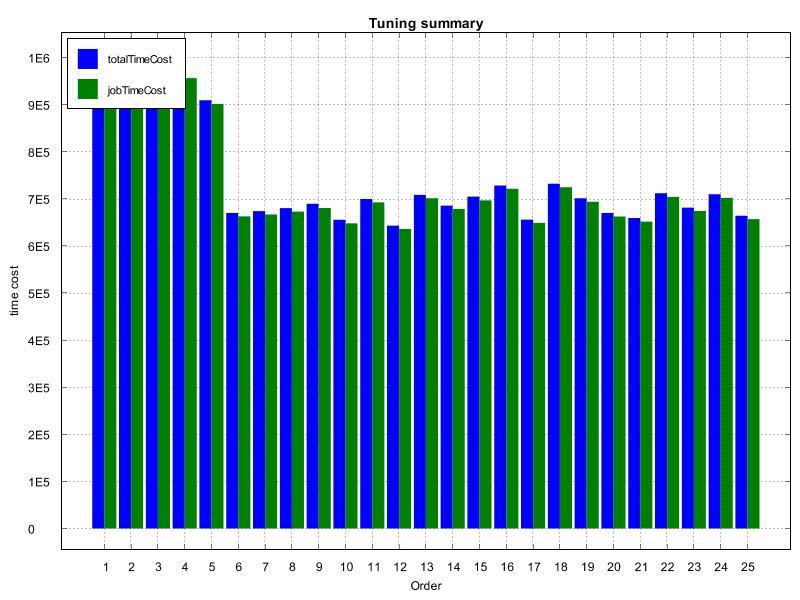

# Performance Analysis Tool

Catla-HS provides a tool to aggregate metric data of MapReduce jobs. Then a summary of job metric data in different phrases and stages is created in table form so the metric data can be used for performance analysis. 

##  A taste of example

When a job tuning is completed, we can use the below codes to manually output a summary of the job's metrics. 

```java
String[] args=new String[] {
				"-tool","log",
				"-dir","\\SOME-PATH\\tuning_wordcount"
		};
		
		CatlaRunner.main(args);
```

## Summarize metric data

Then, Catla-HS output serveral `csv` files showing all metrics. 

The output files includes two types:

1. Detailed metric data inside a MapReduce job, retrieved from Hadoop environments, the file name starting with `detail_` in the history folder. 
2. Aggregated time cost data from diferent iterations of tuning, the file name starting with `timecost_` in the history folder. 

Here are example file contents:

The part of a `detail` summary file is below:

```csv
group	method	submitTime	launchTime	finishTime	task	taskNo	taskStartTime	taskFinishTime	taskInputBytes	taskOutputBytes	taskInputRecords	taskOutputRecords	attemptNo	aStartTime	aFinishTime	mapInputBytes	mapOutputBytes	mapInputRecords	mapOutputRecords	cumulativeCpuUsage	virtualMemoryUsage	physicalMemoryUsage	heapUsage	combineInputRecords	reduceInputGroups	reduceInputRecords	reduceShuffleBytes	reduceOutputRecords	spilledRecords	shuffleFinished	sortedFinished	hostName	hdfsBytesRead	hdfsBytesWritten	fileBytesRead	fileBytesWritten
wordcount	WordCount[1601024855484]	1601024855880	1601024859607	1601024955754	Map	0	1601024859696	1601024864710	1617393	365260	4412	257790	1	1601024861929	1601024864710	4412	-1	2641780	257790	3120	2064584704	239910912	128974848	-1	-1	-1	-1	-1	-1	-1	-1	/default-rack/slave1	1617393	0	0	365260
wordcount	WordCount[1601024855484]	1601024855880	1601024859607	1601024955754	Map	1	1601024859698	1601024864868	1473182	441567	2047	229723	1	1601024861930	1601024864868	2047	-1	2388906	229723	3050	2066456576	237105152	128450560	-1	-1	-1	-1	-1	-1	-1	-1	/default-rack/slave1	1473182	0	0	441567
wordcount	WordCount[1601024855484]	1601024855880	1601024859607	1601024955754	Map	2	1601024859699	1601024864472	1340433	321169	3377	215622	1	1601024861930	1601024864472	3377	-1	2197703	215622	3160	2067615744	235659264	127401984	-1	-1	-1	-1	-1	-1	-1	-1	/default-rack/slave4	1340433	0	0	321169
wordcount	WordCount[1601024855484]	1601024855880	1601024859607	1601024955754	Map	3	1601024859699	1601024864637	883288	346451	2730	139447	1	1601024861924	1601024864637	2730	-1	1436786	139447	2770	2062671872	241967104	129499136	-1	-1	-1	-1	-1	-1	-1	-1	/default-rack/slave1	883288	0	0	346451
wordcount	WordCount[1601024855484]	1601024855880	1601024859607	1601024955754	Map	4	1601024859699	1601024864379	863689	332398	5293	133929	1	1601024861929	1601024864379	5293	-1	1391320	133929	2920	2070106112	250114048	128450560	-1	-1	-1	-1	-1	-1	-1	-1	/default-rack/slave4	863689	0	0	332398
wordcount	WordCount[1601024855484]	1601024855880	1601024859607	1601024955754	Map	5	1601024859699	1601024864336	844530	292732	2624	123161	1	1601024861930	1601024864336	2624	-1	1333055	123161	2380	2064375808	237735936	125829120	-1	-1	-1	-1	-1	-1	-1	-1	/default-rack/slave4	844530	0	0	292732
wordcount	WordCount[1601024855484]	1601024855880	1601024859607	1601024955754	Map	6	1601024859699	1601024864635	840472	292304	2629	122588	1	1601024861913	1601024864635	2629	-1	1326692	122588	2540	2064769024	237088768	125304832	-1	-1	-1	-1	-1	-1	-1	-1	/default-rack/slave1	840472	0	0	292304
wordcount	WordCount[1601024855484]	1601024855880	1601024859607	1601024955754	Map	7	1601024859700	1601024864861	789867	361771	2	143235	1	1601024861944	1601024864861	2	-1	1356060	143235	3110	2064166912	234684416	126877696	-1	-1	-1	-1	-1	-1	-1	-1	/default-rack/slave2	789867	0	0	361771
wordcount	WordCount[1601024855484]	1601024855880	1601024859607	1601024955754	Map	8	1601024859700	1601024864774	736304	334535	2	134448	1	1601024861929	1601024864774	2	-1	1265488	134448	2250	2064449536	236089344	123207680	-1	-1	-1	-1	-1	-1	-1	-1	/default-rack/slave5	736304	0	0	334535
wordcount	WordCount[1601024855484]	1601024855880	1601024859607	1601024955754	Map	9	1601024859700	1601024864640	730624	316887	2	138437	1	1601024861923	1601024864640	2	-1	1281049	138437	2210	2063048704	233807872	124780544	-1	-1	-1	-1	-1	-1	-1	-1	/default-rack/slave5	730624	0	0	316887
wordcount	WordCount[1601024855484]	1601024855880	1601024859607	1601024955754	Map	10	1601024859700	1601024864765	717398	352151	2	131657	1	1601024861929	1601024864765	2	-1	1235257	131657	2530	2064732160	235757568	123207680	-1	-1	-1	-1	-1	-1	-1	-1	/default-rack/slave5	717398	0	0	352151
wordcount	WordCount[1601024855484]	1601024855880	1601024859607	1601024955754	Map	11	1601024859700	1601024864765	696750	340323	2	123786	1	1601024861945	1601024864765	2	-1	1184045	123786	2800	2066411520	239706112	125304832	-1	-1	-1	-1	-1	-1	-1	-1	/default-rack/slave5	696750	0	0	340323
wordcount	WordCount[1601024855484]	1601024855880	1601024859607	1601024955754	Map	12	1601024859701	1601024864739	679423	317609	2	120707	1	1601024861954	1601024864739	2	-1	1160013	120707	2530	2064314368	240947200	125304832	-1	-1	-1	-1	-1	-1	-1	-1	/default-rack/slave3	679423	0	0	317609
wordcount	WordCount[1601024855484]	1601024855880	1601024859607	1601024955754	Map	13	1601024859701	1601024864843	671642	310803	3	123614	1	1601024861933	1601024864843	3	-1	1163636	123614	2970	2066649088	247635968	126353408	-1	-1	-1	-1	-1	-1	-1	-1	/default-rack/slave2	671642	0	0	310803
wordcount	WordCount[1601024855484]	1601024855880	1601024859607	1601024955754	Map	14	1601024859701	1601024864693	667218	316733	2	121515	1	1601024861941	1601024864693	2	-1	1151177	121515	2550	2067505152	250449920	127401984	-1	-1	-1	-1	-1	-1	-1	-1	/default-rack/slave3	667218	0	0	316733

```

The `timecost` summary file is below:

```csv
TimeStamp	Order	mapreduce.task.io.sort.mb	mapreduce.map.sort.spill.percent	totalTimeCost	jobTimeCost	avgMapTimeCost	avgReduceTimeCost	avgShuffleTimeCost	avgSortTimeCost	setupTimeCost
1601024855484	1	40	.40	99874	96147	2312	84896	81227	2233	3727
1601024970025	2	40	.60	100245	96341	2308	86135	82269	2325	3904
1601025083022	3	40	.80	100894	97045	2311	86836	82337	2794	3849
1601025196864	4	60	.40	100775	97011	2350	85800	81285	2877	3764
1601025309935	5	60	.60	100211	96438	2343	85121	81318	2235	3773
1601025421099	6	60	.80	98981	95272	2337	85052	81275	2270	3709
1601025532372	7	80	.40	99863	96445	2331	85155	81329	2336	3418
1601025643219	8	80	.60	99790	96186	2343	86000	82268	2229	3604
1601025754379	9	80	.80	100364	96318	2339	85114	81282	2317	4046

```

You can find the above files [here](https://github.com/dhchenx/Catla-HS/tree/master/examples/sample_metric_data)

## Obtaining tuning metrics

We can compare multiple tuning projects' metric data by running below codes:

```java
	String[] projects=new String[] {"tuning_reducejoin","tuning_terasort","tuning_wordcount"};
		System.out.println("Application\tMininum Tuning Time\tMinimum Job Time");
		for(int i=0;i<projects.length;i++) {
			TuningMetrics tm=new TuningMetrics("E:\\CatlaHS\\"+projects[i]);
			tm.extract("wordcount");
			System.out.println(tm.getProjectName()+"\t"+tm.getMinTuningTime()+"\t"+tm.getMinJobTime());
		}
```

The output is below, showing comparison of the metrics, namely `mininum tuning time` and `mininum job time`. 

```csv
Application	Mininum Tuning Time	Minimum Job Time
tuning_reducejoin	32188	23447
tuning_terasort	29172	21682
tuning_wordcount	110847	98981
```

## Visualizing specific metric data

Or you can retrieve specific metric data fields from a job's metric file by using the below codes:

```java
	public static void main(String[] args) {
		String data_path="E:\\CatlaHS\\bobyqa-two\\history\\timecost_cac_count.csv";
		JobSummary ts=new JobSummary(data_path);
		ts.load("Order",new String[] {"totalTimeCost" , "jobTimeCost"},"bar");
	}
```

With the use of the performance visualization tool in Catla-HS, we can visualize the metric data like below:


