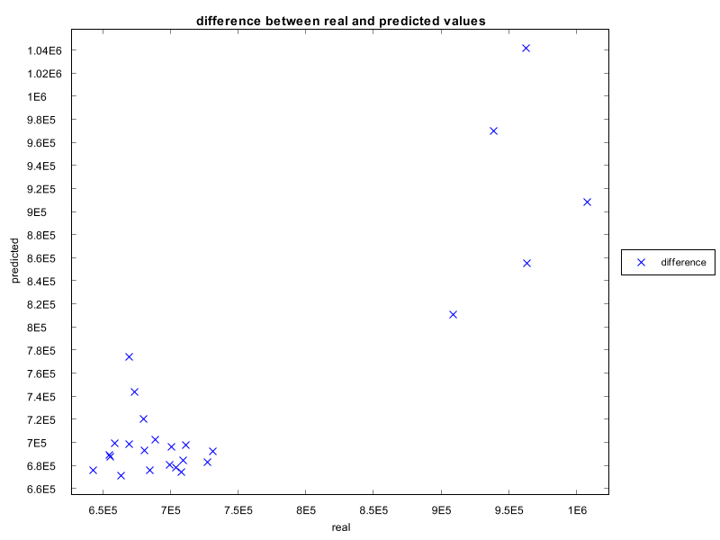

# Predictor Runner

In Catla-HS, there is an additional component called *PredictorRunner* to facilitate performance change's fitting and predition. With the use of multiple fitting analysis, we can establish the prediction model for evaluating MapReduce job  performance. 

## Model support

The component currently supports:

1) linear fitting
2) multivariate linear fitting
3) logarithmic fitting
4) exponential fitting
5) polynomial fitting

More models can be adapted within the system following the common interface of `Predictor`. 

## Design

The interface of `Predictor`:

```java
package cn.edu.bjtu.cdh.catla.prediction;

public interface Predictor {
	public void fit();
	public void predict();
	public void plot();
	public void plotError();
}
```

Then we create a factory for creating instance of `Predictor` to support multiple fitting models, like:

```java
package cn.edu.bjtu.cdh.catla.prediction;
import java.util.Map;

public class PredictorFactory {
	public static Predictor createInstance(Map<String,String>options,String type,String[] xfields,String[] yfields, String[][] x_data,String[][] y_data) {
		if(type.equals("poly")) {
			return new PolyPredictor(options,xfields,yfields,x_data,y_data);
		}else if (type.equals("line")) {
			return new LinePredictor(options,xfields,yfields,x_data,y_data);
		}else if (type.equals("lineXs")) {
			return new LineXsPredictor(options,xfields,yfields,x_data,y_data);
		}else if (type.equals("exp")) {
			return new ExpPredictor(options,xfields,yfields,x_data,y_data);
		}else if (type.equals("log")) {
			return new LogPredictor(options,xfields,yfields,x_data,y_data);
		}
		return null;
	}
}

```

So when running the `PredictorRunner`, the runner can implement the functions `fit()`, `predict()`, `plot()` and `plotError()`. 

Implementing a specific fitting model, for example, for polynomial fitting, we can define:

```java
package cn.edu.bjtu.cdh.catla.prediction;

import java.util.Map;

import org.knowm.xchart.SwingWrapper;
import org.knowm.xchart.internal.chartpart.Chart;

import cn.edu.bjtu.cdh.catla.visualization.CatlaChart;
import cn.edu.bjtu.cdh.catla.visualization.ChartFactory;

public class PolyPredictor extends CommonPredictor implements Predictor {
	// raw data
	private Map<String, String> options;
	private String[][] x_data, y_data;
	// estimated parameters for the prediction model
	private double[] model_result;
	// real transformed data for fitting model
	private double[][] x;
	private double[] y;
	// estimated/predicted y based on input x
	private double[] predicted_ys;
	// input and output x,y fields
	private String[] x_fields, y_fields;

	public PolyPredictor(Map<String, String> options, String[] xfields, String[] yfields, String[][] xdata,
			String[][] ydata) {
		this.options = options;
		this.x_data = xdata;
		this.y_data = ydata;
		this.x_fields = xfields;
		this.y_fields = yfields;
	}

	public void fit() {

		this.x = toParseDoubleMatrix(x_data);
		this.y = toParseDoubleList(y_data[0]);

		int n = Integer.parseInt(options.getOrDefault("-n", "3"));

		this.model_result = MathUtil.dxsFitting(x[0], y, n);

	}

	public void predict() {
		double[] predicted_ys = new double[x_data[0].length];
		for (int i = 0; i < x_data[0].length; i++) {
			double predicted_y = MathUtil.getDxsValueByX(x[0][i], new double[] { this.model_result[0],
					this.model_result[1], this.model_result[2], this.model_result[3] });
			predicted_ys[i] = predicted_y;
		}
		this.predicted_ys = predicted_ys;
	}

	public void plot() {
		// plot data transformation
		String[][] plot_x = new String[x_data[0].length][x_data.length];
		for (int i = 0; i < plot_x.length; i++) {
			for (int j = 0; j < plot_x[i].length; j++) {
				plot_x[i][j] = x_data[j][i];
			}
		}

		String[][] plot_y = new String[x_data[0].length][2];
		for (int i = 0; i < plot_y.length; i++) {
			plot_y[i][0] = y_data[0][i];
			plot_y[i][1] = predicted_ys[i] + "";
		}

		// print plot dataset
		printTable("x", plot_x);
		printTable("y", plot_y);

		String plot_type = options.getOrDefault("-plot_type", "line");
		String plot_title = options.getOrDefault("-plot_title", "");

		// show graph
		CatlaChart chart = ChartFactory.createChart(plot_type, plot_title, x_fields[0], y_fields[0], plot_x, plot_y,
				new String[] { "real", "predicted" });
		new SwingWrapper<Chart>(chart.getChart()).displayChart();

	}

	public void plotError() {
		// plot data transformation

		String[][] plot_x = new String[y_data[0].length][1];
		for (int i = 0; i < y_data[0].length; i++) {
			plot_x[i][0] = y_data[0][i];
		}

		String[][] plot_y = new String[x_data[0].length][1];
		for (int i = 0; i < plot_y.length; i++) {

			plot_y[i][0] = predicted_ys[i] + "";
		}

		// print plot dataset
		printTable("x", plot_x);
		printTable("y", plot_y);

		// show graph
		CatlaChart chart = ChartFactory.createChart("scatter", "difference between real and predicted values", "real", "predicted", plot_x, plot_y,
				new String[] { "difference" });
		new SwingWrapper<Chart>(chart.getChart()).displayChart();
	}

}

```

## Usage example

Here are some usage examples to perform prediction analysis in Catla-HS. 

```java
	public static void testPoly()  {
		String[] args=new String[] {
				"-dir","E:\\CatlaHS\\bobyqa-two\\history",
				"-predictor","poly",
				"-x","Order",
				"-y","totalTimeCost",
				"-plot_type","line",
				"-plot_title","Tuning summary",
				"-n","3"
		};
		PredictorRunner.main(args);
	}
```

The `-dir` parameter should be assigned with the path of history folder or project folder. 

Here are the results:

Fitting model:


Comparison between real values and predicted values:




Other models can be similiarly estimated using `PredictorRunner` in Catla-HS. 


