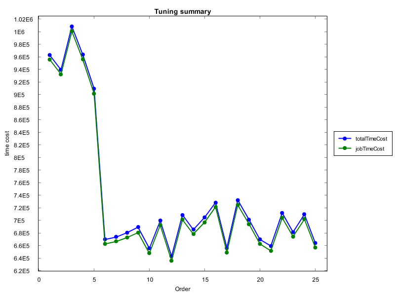
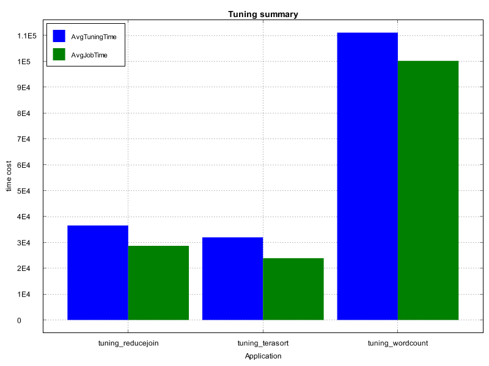

# Performance Visualization Tool

A significant improvement in Catla-HS compared to Catla is intregrating the Performance Visualization Tool. 

## Introduction

The tool is established upon the open-source project [XCharts](https://github.com/knowm/XChart). It is used for visualizing the metric data obtained from running MapReduce jobs and user-defined metrics in Catla-HS. 

## Design

First, the implementation of Chart is here:

```java
package cn.edu.bjtu.cdh.catla.visualization;
import org.knowm.xchart.internal.chartpart.Chart;

public interface CatlaChart {
	public Chart getChart();
}

```

Then, we can implement `Chart` with multiple charts. For example, here we implement `SimpleXYChart` for visualizing the line charts. 

```java
package cn.edu.bjtu.cdh.catla.visualization;

import java.util.ArrayList;
import java.util.List;

import org.knowm.xchart.*;
import org.knowm.xchart.internal.chartpart.Chart;
import org.knowm.xchart.style.Styler.ChartTheme;
import org.knowm.xchart.style.markers.SeriesMarkers;

public class SimpleXYChart implements CatlaChart {

	private String title;
	private String x_title;
	private String y_title;
	private String[][] x_data;
	private String[][] y_data;
	private String[] seriesNames;
	
	public SimpleXYChart(String title,String xTitle,String yTitle,String[][] X,String[][] Y,String[] seriesNames) {
		this.title=title;
		this.x_title=xTitle;
		this.y_title=yTitle;
		this.x_data=X;
		this.y_data=Y;
		this.seriesNames=seriesNames;
	}
	
	private List<List<Double>> array2List(String[][] data){
		List<List<Double>> list=new ArrayList<List<Double>>();
		for(int i=0;i<data[0].length;i++) {
			List<Double> dlist=new ArrayList<Double>();
			for(int j=0;j<data.length;j++) {
				dlist.add(Double.parseDouble(data[j][i]));
			}
			list.add(dlist);
		}
		return list;
	}
	 
	public Chart getChart() {

		// Create Chart
		XYChart chart = new XYChartBuilder().width(800).height(600).theme(ChartTheme.Matlab).title(this.title)
				.xAxisTitle(this.x_title).yAxisTitle(this.y_title).build();

		// Customize Chart
		chart.getStyler().setPlotGridLinesVisible(false);
		chart.getStyler().setXAxisTickMarkSpacingHint(100);

		// Series
		List<List<Double>> x_series=array2List(x_data);
		List<List<Double>> y_series=array2List(y_data);
		
		// System.out.println(x_series.size());
		

		XYSeries series = chart.addSeries(seriesNames[0],x_series.get(0),y_series.get(0));
		series.setMarker(SeriesMarkers.CIRCLE);
		
			

		return chart;
	}


}
```

## Examples

In Catla-HS, the visualization tool can be used to visualize the metric data. 

### Job summary

When we finished tuning, we can illustrate the change of performance (like job time) using the tool. 

A simple example using Java codes is here. 

```java
	public static void main(String[] args) {
		String data_path="E:\\CatlaHS\\bobyqa-two\\history\\timecost_cac_count.csv";
		JobSummary ts=new JobSummary(data_path);
		ts.load("Order",new String[] {"totalTimeCost" , "jobTimeCost"},"bar");
	}
	
```

Some examples are here: 

For example, we compared the performance changes of two job metrics, namely, totalTimeCost and jobTimeCost. Then, we got:



If we illustrated the metric data using `BarChart`, then we got:


### Tuning summary

To monitor and evaluate the performance of tuning efficiency in Catla-HS, we introduce a class for estimating the tuning metrics.

To obtain tuning metrics, we can use the below example. The example obtains metrics from three projects, namely `tuning_reducejoin`, `tuning_terasort`, and `tuning_wordcount`. Then, it summarizes the key metrics from the historic data during the tuning process. 

```java
	public static void main(String[] args) {
		String[] projects=new String[] {"tuning_reducejoin","tuning_terasort","tuning_wordcount"};
		for(int i=0;i<projects.length;i++) {
			TuningMetrics tm=new TuningMetrics("E:\\CatlaHS\\"+projects[i]);
			tm.extract("wordcount");
			System.out.println(tm.getProjectName()+"\t"+tm.getMinTuningTime()+"\t"+tm.getMinJobTime());
		}
		
	}
	
```
Using the visualization tool can use:

```java
public static void main(String[] args) {
		String rootPath="E:\\CatlaHS\\";
		String[] projects=new String[] {rootPath+"tuning_reducejoin",rootPath+"tuning_terasort",rootPath+"tuning_wordcount"};
		TuningSummary ts=new TuningSummary(projects);
		ts.load("Application", new String[] {"AvgTuningTime","AvgJobTime"}, "bar");
	}
```

The result is illustrated here:



All tuning metrics supported in Catla-HS include:

```java
String[] lines=new String[] {
					tm.getProjectName(),
					tm.getTotalTuningTime()+"",
					tm.getAvgTuningTime()+"",
					tm.getAvgJobTime()+"",
					tm.getDifferenceOfTuningTime()+"",
					tm.getNumberOfTunings()+"",
					tm.getMaxTimeStamp()+"",
					tm.getMinTimeStamp()+"",
					tm.getMaxJobTime()+"",
					tm.getMinJobTime()+"",
					tm.getMaxJobTimeId()+"",
					tm.getMinJobTimeId()+"",
					tm.getMaxTuningTime()+"",
					tm.getMinTuningTime()+"",
					tm.getMaxTuningId()+"",
					tm.getMinTuningId()+""
			};
```

Therefore, using the tool can visualize and compare the metrics. 